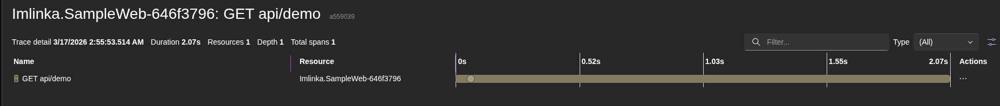
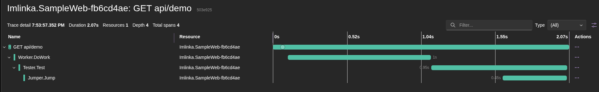
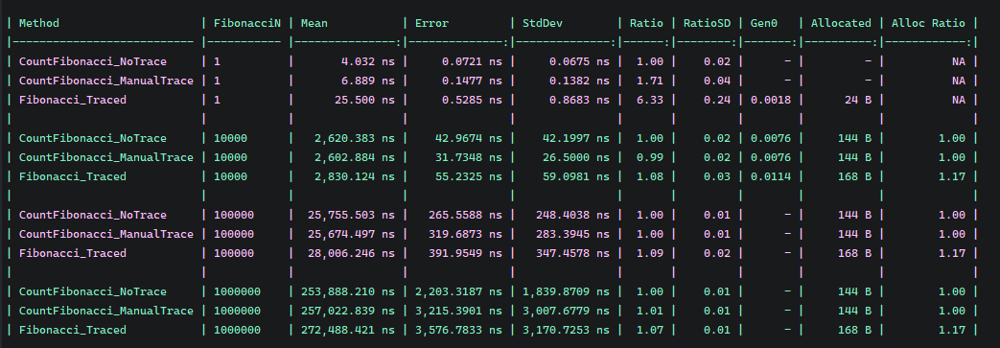

# Imlinka

<p align="center">
	
</p>

`Imlinka` is a tracing injection library for .NET.
It wraps registered services with `DispatchProxy` and emits `Activity` spans automatically.

## What It Solves

Seeing meaningful method-level spans in traces usually requires manually wrapping calls in `Activity` blocks.
That approach is repetitive, easy to get wrong, and hard to maintain in larger codebases.

`Imlinka` removes that manual work by adding method/assembly-level tracing without changing service implementations.

Trace without using the explicit 'Activity':


Trace with Imlinka's automatic method-level spans:


## Installation

```bash
dotnet add package Imlinka
```

## Attribute-Based Tracing

Use `[Traced]` to trace all public methods of the interface or class.

```csharp
using Imlinka;

[Traced]
public interface IWorker
{
    Task DoWork();
    Task RebuildCache();
}
```

Use `[Trace]` to trace specific methods.

```csharp
using Imlinka;

public interface IReportService
{
    [Trace("report.generate")]
    Task<byte[]> GenerateAsync(Guid id);

    [Trace]
    Task UploadAsync(byte[] data);

    Task<bool> ExistsAsync(Guid id);
}
```

If `SpanName` is not provided, the default format is `{TypeName}.{MethodName}`.

## DI Integration

Register your services first, then apply tracing injection.

```csharp
using Imlinka;

builder.Services.AddScoped<IWorker, Worker>();
builder.Services.AddScoped<IJumper, Jumper>();
builder.Services.AddScoped<ITester, Tester>();

builder.Services.AddProjectTracingForAssembly(
    typeof(IWorker).Assembly,
    options => options
        .WithPublicMethodsTracing()  // Automatically trace ALL public methods.
        .WithActivitySource(Telemetry.ActivitySource)
        .IgnoreDefaultNamespaces());
```

If `.WithPublicMethodsTracing()` used, all public methods of registered classes will be traced, even without `[Traced]` or `[Trace]` attributes.

## Benchmarks

[Benchmarks](./Imlinka.Benchmarks) shows that Imlinka adds minimal overhead to method calls.

<p align="center">
	
</p>

## Sample Project

See [Imlinka.SampleWeb](./Imlinka.SampleWeb) for a complete ASP.NET example.

## License

Imlinka is licensed under the MIT License. See `LICENSE` for details.
